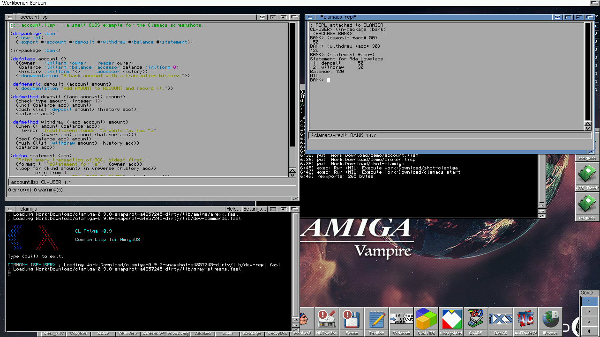
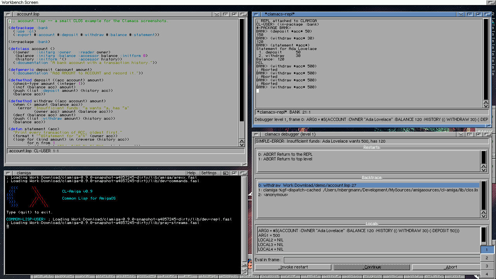
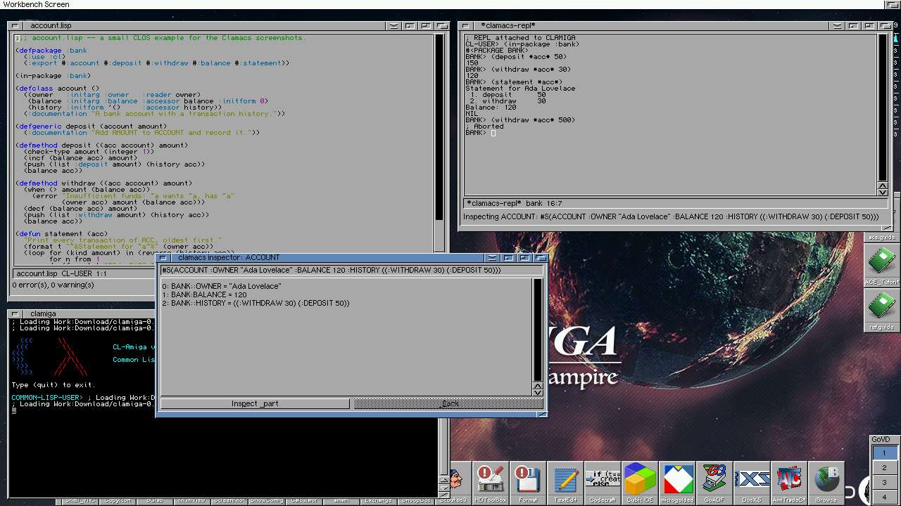
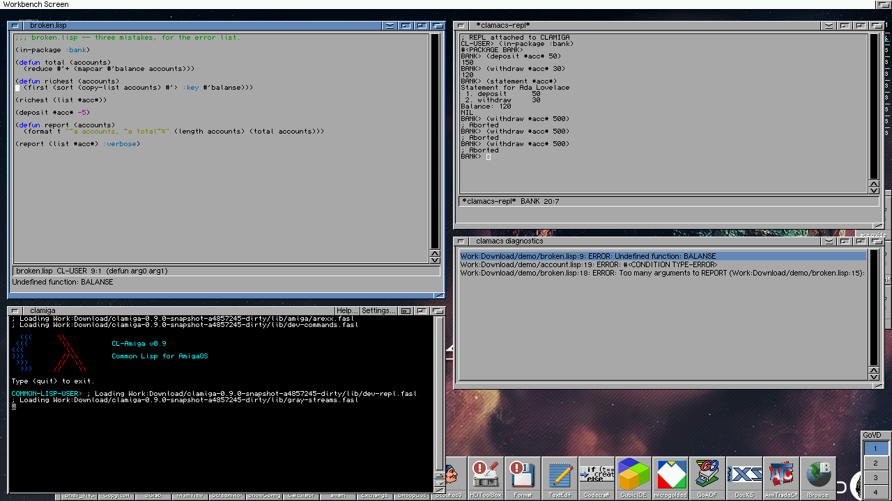

# Clamacs

An Emacs-flavoured Common Lisp IDE for AmigaOS 3 and MorphOS: a native MUI
editor with Emacs key handling that talks to a running
[CL-Amiga](https://github.com/mdbergmann/cl-amiga) (`clamiga`) over its ARexx
port — load, compile, evaluate, a REPL, a debugger and an inspector in
their own windows.

**Status:** phases 1 to 4 run on AmigaOS 3 (MUI 3.8) and MorphOS (MUI 4) —
the editor with Lisp mode, a menu strip and its own ARexx port,
introspection (arglist, completion, jump to
definition, describe, apropos, macroexpand) asked from clamiga, a REPL
window (`C-c C-z`) fed by a REPL thread in clamiga that streams output,
asks the editor for `read-line` input and can be interrupted, a debugger
window that opens when a form at that REPL signals an error (restarts,
backtrace, locals, eval in a frame; the REPL thread stays parked on the
erring stack until a restart is chosen), and an inspector window
(`C-c I`) with a parts list and a Back button. See `CLAUDE.md` for the
design and the phase plan, and `specs/clamacs-ide.md` for the full one.

## Screenshots

Taken on a Vampire V4 (AmigaOS 3.2, MUI 3.8, 1280x720) driving the
clamiga from the binary release.

A file loaded with `C-c C-k` and the `*clamacs-repl*` window (`C-c C-z`)
talking to it, the clamiga console at the bottom:



An error signalled at the REPL prompt parks clamiga's REPL thread and opens
the debugger window: condition, restarts, backtrace, the locals of the
selected frame and an eval-in-frame line:



`C-c I` evaluates a form and opens the inspector on its value; a part
descends, Back comes up:



Loading a file with mistakes fills the diagnostics window; a click on a row
or `C-x \`` puts the cursor on the offending line, with the message in the
echo area:



## Window positions

Arrange the windows, then pick **Windows > Snapshot Windows** (or `M-x
clamacs-snapshot-windows`): the position and size of every open window is
written to `ENVARC:Clamacs/windows.cfg` (and `ENV:`), and the windows come
up there from then on — the REPL, the debugger, the inspector, the error
list, and the file windows in the order they are opened (the first file of
a session where the first file window was, and so on). The file is plain
text, one `role left top width height` line per window; edit it or delete
it to start over. Snapshotting again only updates the windows that are
open at the time.

## Layout

```
src/emacs/                 keymaps, raw-key decoding rules, command table, menu table, kill ring, minibuffer history, window positions
src/lisp/                  tokenizer, sexp scanner, indenter
src/rexx/                  diagnostic parser, request queue, the rc ladder, the REPL thread's messages
src/*.c                    the MUI half: custom classes, windows, ARexx, introspection, the REPL, main
tests/                     host unit tests for everything under emacs/ lisp/ rexx/
verify/realamiga/          unattended FS-UAE run, driven through the ARexx port;
                           sendkey.c injects real key events through input.device
docs/memory.md             what the editor costs on an 8 MB machine
vendor/texteditor/         submodule: TextEditor.mcc (amiga-mui), pinned to release 15.56
```

Clamacs is a git submodule of [cl-amiga](https://github.com/mdbergmann/cl-amiga)
(checked out at `cl-amiga/clamacs`) and ships in its binary release next to
the `clamiga` binaries. The runtime it drives is the superproject: build
`clamiga` there, and make runtime changes (new `EXT.DEV` commands, compiler
fixes) as commits there under its gates.

## Building and testing

```
make test                        # host unit tests for the portable core
make -f Makefile.cross amiga     # cross-compile build/cross/clamacs (and sendkey)
make -f Makefile.cross test-amiga # unattended FS-UAE run, then check the log
make -f Makefile.mos             # MorphOS: native build on the box, see the file's header
```

`make test` builds only the half of the editor that takes no MUI and no OS
types. That split is a design rule, not a convenience: the keymap engine, the
Lisp tokenizer, the sexp scanner, the indenter, the diagnostic parser and the
request queue all run on the host, so a failing assertion costs a second
instead of an emulator boot.

The FS-UAE run uses the clamiga runtime from the superproject (the
`CLAmiga:` volume; the integration leg reads its `build/cross/clamiga`, so
run `make -f Makefile.cross amiga` in `cl-amiga` first). The Workbench image
(with MUI and TextEditor.mcc) and `FS-UAE.app` are not tracked in git; the
run takes them from the superproject's `verify/realamiga/` too. A standalone
clone falls back to a `cl-amiga` checkout next to it. Override with
`EMU_DIR` (the emulator assets) and `CLAMIGA_DIR` (the clamiga runtime).

## Requirements on the Amiga

MUI 3.8 or newer (`muimaster.library` 19+) and `TextEditor.mcc` 15.29 or
newer installed in `MUI:Libs/mui/`; the editor checks both at startup.
Verified against MUI 3.8 and TextEditor.mcc 15.56.

`vendor/texteditor` is used for its headers, documentation and demo only —
the editor subclasses the *installed* `TextEditor.mcc` at runtime and never
builds the class. Its `include/` directory also carries `libraries/mui.h`,
the muimaster protos and the SDI headers, so a MUI application compiles
against it without the MUI developer kit.

## Setup

Clamacs carries no cross toolchain of its own; it builds with the one
cl-amiga installs (`tools/setup-toolchain.sh` there, one level up from this
directory):

```
git clone --recursive https://github.com/mdbergmann/cl-amiga.git
cd cl-amiga && tools/setup-toolchain.sh        # once, for both projects
cd clamacs && make -f Makefile.cross amiga
```

A standalone clone (`git clone --recursive https://github.com/mdbergmann/clamacs.git`)
points the build at an existing install instead:

```
make -f Makefile.cross amiga TOOLCHAIN=/path/to/cl-amiga/tools/m68k-amigaos-gcc/prefix
```

The MorphOS build is native: `make -f Makefile.mos` in a checkout on a
MorphOS machine with the SDK's gcc (no PPC cross-compiler exists for the
Mac). MorphOS ships `TextEditor.mcc`, so nothing else is needed there.
