# Clamacs

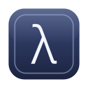

An Emacs-flavoured Common Lisp IDE for AmigaOS 3, MorphOS, macOS and
Linux.  The editor is written in Common Lisp and runs as an instance of
[CL-Amiga](https://github.com/mdbergmann/cl-amiga) (`clamiga`) of its own;
the Lisp you work on lives in a *second* clamiga that the editor talks to
over a wire -- its ARexx port on the Amiga, a TCP port on the host.  Over
that wire it loads and compiles files, evaluates forms, feeds a REPL,
opens a debugger when a form signals, an inspector on any value, and
asks for the arglist, completions, descriptions, apropos, macroexpansions
and source locations.

On AmigaOS and MorphOS it is a native MUI application (one window per
buffer, plus the REPL, debugger, inspector and diagnostics windows); on
the host it is one native window with the buffers as tabs and the tools
in a dock below them.  Everything Emacs about it -- the keys, Lisp mode,
the minibuffer, the menus -- is the same code on every platform
(`lisp/`, `specs/clamacs-lisp.md`; the C editor under `src/` is its frozen
predecessor).  `CLAUDE.md` has the design, `specs/clamacs-ide.md` the full
plan.

## Screenshots

### AmigaOS

Taken on a Vampire V4 (AmigaOS 3.2, MUI 3.8, 1280x720) driving the
clamiga from the binary release.

A file loaded with `C-c C-k` and the `*clamacs-repl*` window (`C-c C-z`)
talking to it, the clamiga console at the bottom:

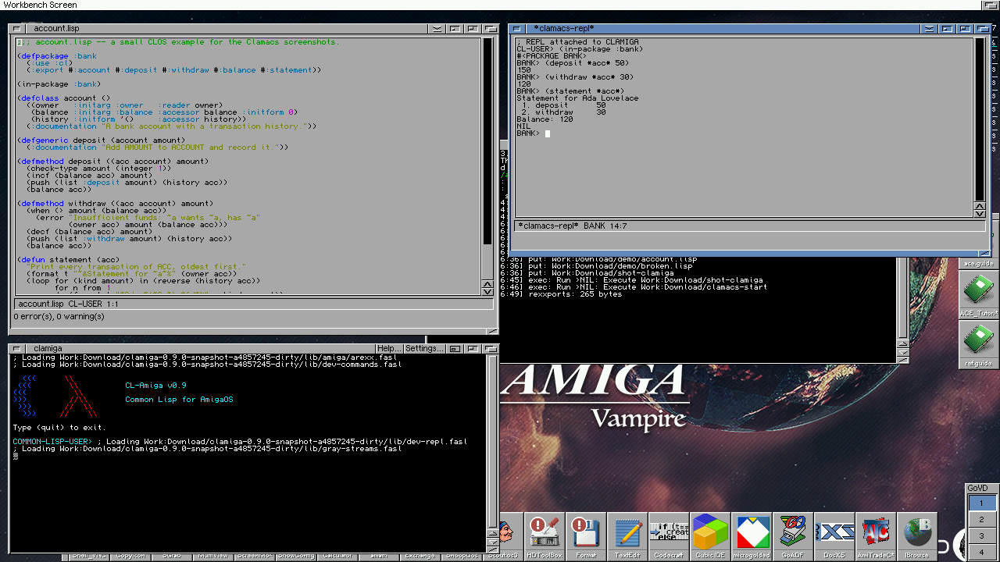

An error signalled at the REPL prompt parks clamiga's REPL thread and opens
the debugger window: condition, restarts, backtrace, the locals of the
selected frame and an eval-in-frame line:

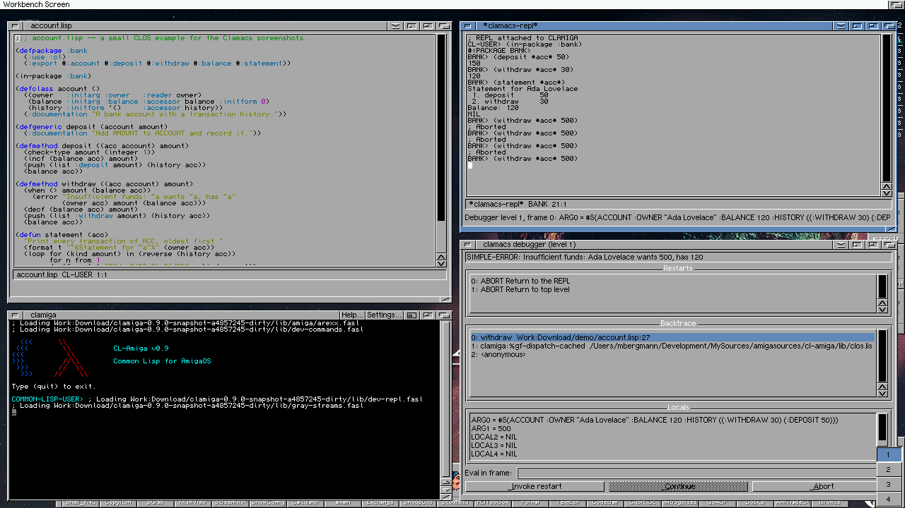

`C-c I` evaluates a form and opens the inspector on its value; a part
descends, Back comes up:

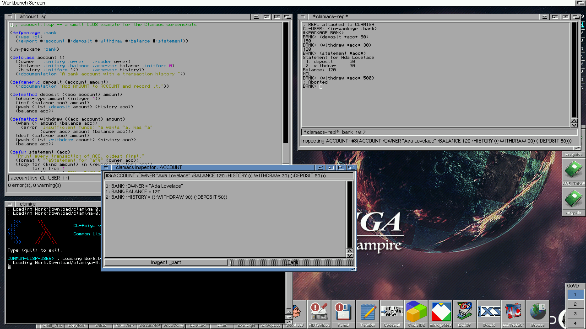

Loading a file with mistakes fills the diagnostics window; a click on a row
or ``C-x ` `` puts the cursor on the offending line, with the message in the
echo area:

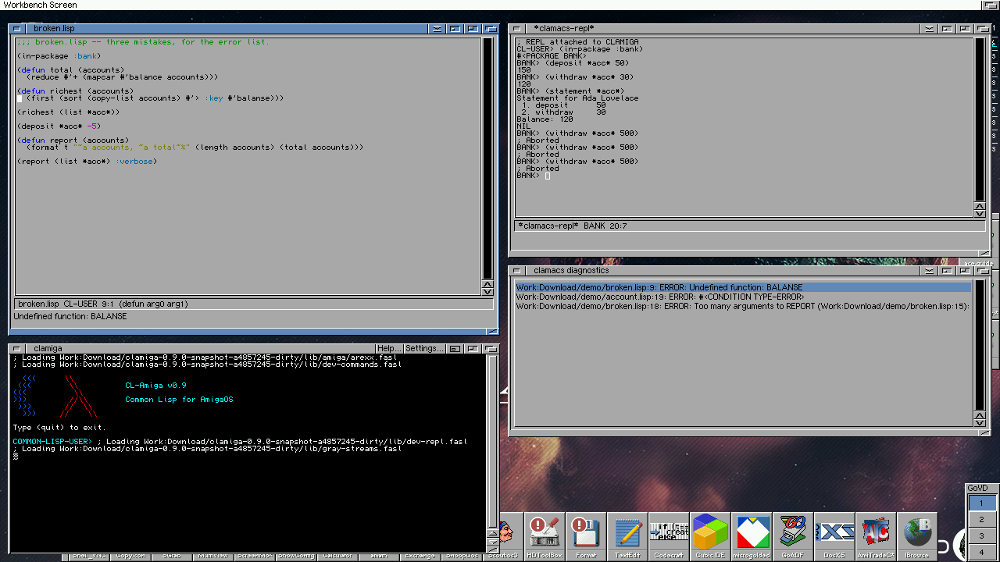

### MorphOS

The same editor on a MorphOS 3.20 box (MUI 4, 1920x1080): the ledger of
`verify/host/shots/accounts.lisp` loaded with `C-c C-k`, the REPL window
that fed it, and the debugger window an overdraft at the prompt opened:

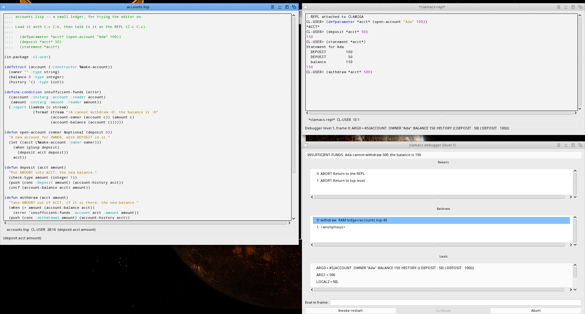

### macOS

The same editor on a Mac (`host/run.sh`), taken from the running editor by
`verify/host/shots.sh`, which drives it through the states below over its
own port and photographs each one -- the file is
`verify/host/shots/accounts.lisp`, a small ledger.

The document window: the source with its colouring and the minimap, the
`*clamacs-repl*` tab in the dock talking to the clamiga the editor
started, a `; Evaluated:` note from `C-c C-c` and the arglist in the
status line:

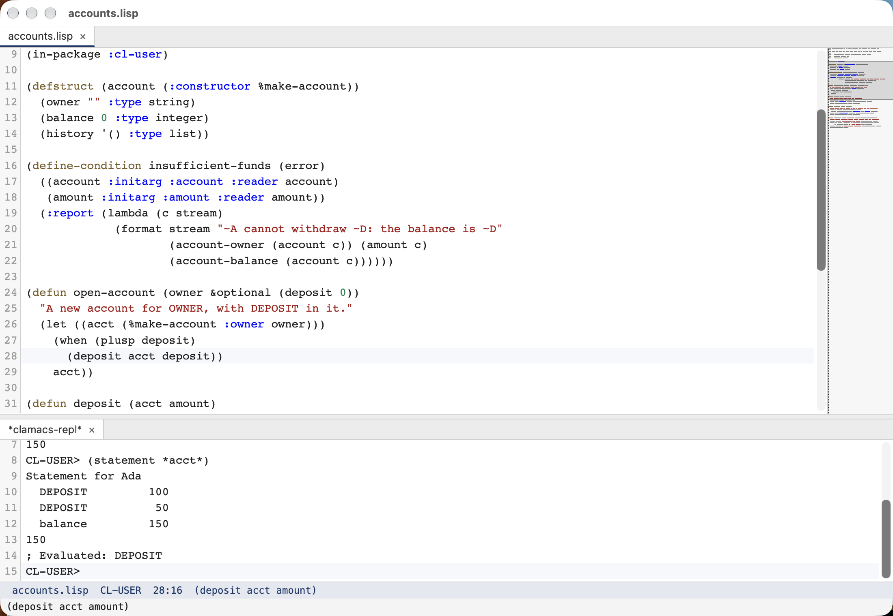

An overdraft signalled at the prompt opens the Debugger panel: the
condition, the restarts, the backtrace with the frame's source line, the
locals of the selected frame, the eval-in-frame line and its buttons:

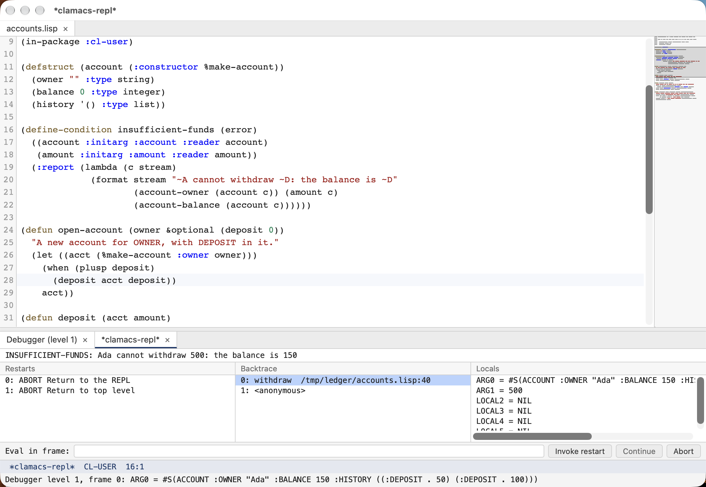

`C-c I` on `*acct*` opens the Inspector panel with the structure's parts:

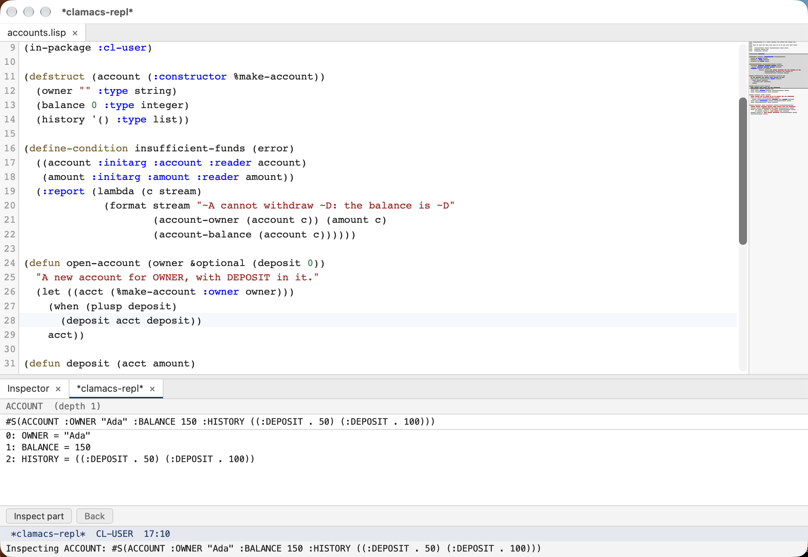

`C-c C-k` on a file with two mistakes fills the Diagnostics panel, and
``C-x ` `` puts the cursor on the first one with its message in the echo
area:

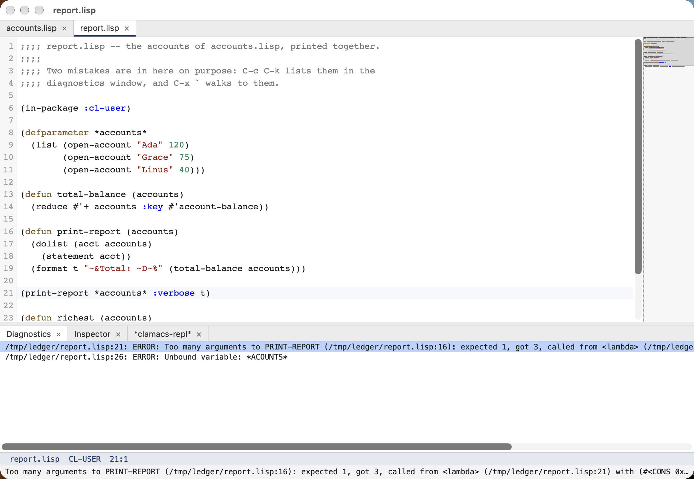

The One Dark theme (View > Themes), and `M-x clamacs-eval` TAB with its
candidates listed above the status line:

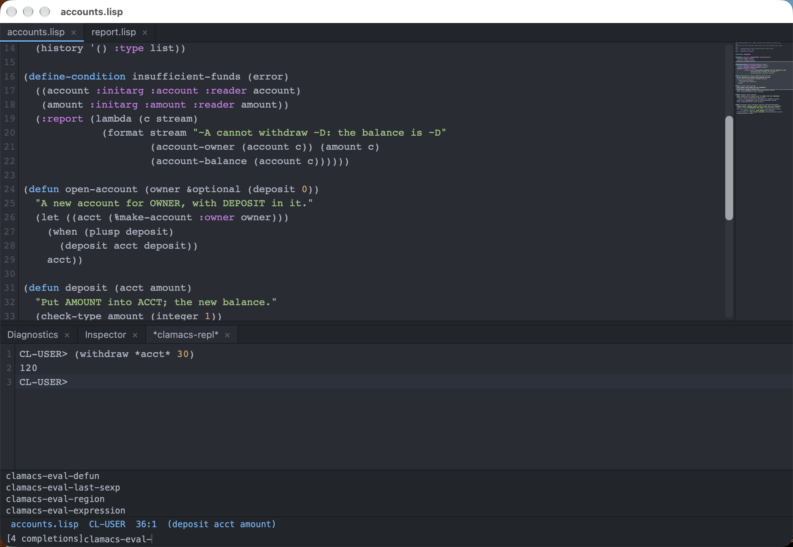

## Starting the editor

### AmigaOS and MorphOS

The binary release of cl-amiga ships the editor next to the `clamiga`
binaries: its `Clamacs` Workbench icon starts it from a heap image, which is

```
clamiga --image clamacs.img --non-interactive --eval "(clamacs::run)" -- file.lisp ...
```

From a checkout it starts from source instead:

```
clamiga --heap 8M --non-interactive --load Clamacs:lisp/clamacs.lisp -- file.lisp ...
```

The files come after `--` (a bare argument before it is something for
clamiga to load); without any, one unnamed Lisp buffer opens.  The Amiga
needs MUI and `TextEditor.mcc`, see "Requirements on the Amiga" below.

### macOS and Linux

```
host/run.sh file.lisp ...        # builds what is missing, then starts the editor from source
IMAGE=1 host/run.sh file.lisp    # the same from its heap image (made and verified on first use)
make host-app                    # macOS: build/host-frontend/Clamacs.app, the editor as an application
```

`host/build.sh` needs the network once, for the webview library and the
CodeMirror packages (both pinned and checked); the editor itself does
not.  **Linux** needs GTK 3 and WebKitGTK 4.1 with their headers
(Debian/Ubuntu: `libgtk-3-dev libwebkit2gtk-4.1-dev`; 4.0 is taken when
4.1 is missing), `pkg-config`, gcc/g++ and node.  **Windows** (an MSYS2
shell, WebView2) has its shim written and compiled against the API with
mingw-w64, but has not been run on a Windows machine yet.  "The host
frontend" below has the rest.

## Talking to clamiga

The editor is a clamiga, but the Lisp you load into, evaluate in and
debug is a separate one.  The **Clamiga** menu manages it: **Connect**
(`M-x clamacs-connect`) looks for a clamiga's port and attaches to it --
and offers to start one when there is none; **Start clamiga** (`M-x
run-lisp`) starts one on the binary the editor runs on and connects to
it, as the first `C-c C-c` offers to.  When clamiga was restarted, the
next evaluation finds the new one and attaches the REPL again by itself
(the echo area says where it was found).

**On AmigaOS and MorphOS the wire is ARexx.**  A clamiga you start
yourself opens its port with

```lisp
(require "amiga/arexx")
(amiga.arexx:start)                  ; port CLAMIGA; a second instance takes CLAMIGA.1, ...
```

(in `S:.clamigarc`, or at its prompt), and the editor finds it by
scanning `CLAMIGA`, `CLAMIGA.1`, ... .  The clamiga the editor starts
itself gets a console window of its own and opens its port from a
preamble the editor writes.

**On the host the wire is TCP**, over cl-amiga's `dev-tcp` port.  A
clamiga you start yourself opens it with

```lisp
(require "dev-tcp")
(ext.dev.tcp:start)                  ; 127.0.0.1:4005, token drawn and printed once
(ext.dev.tcp:start :port 4005 :token "...")
(ext.dev.tcp:start :host "192.168.1.5")  ; reachable from the LAN, on this one address
```

and `CLAMACS_CLAMIGA=host:port` (default `127.0.0.1:4005`) and
`CLAMACS_CLAMIGA_TOKEN` in the editor's environment name it -- an Amiga
on the LAN included, when its port was started with `:host` and the
editor with `--bind` (see "The editor's own port").  The clamiga the
editor starts gets its token through its environment, writes its port
number to a file in the editor's private directory and its output to
`clamacs-clamiga.log` there; the editor stops only a clamiga it started.
The token authenticates; nothing is encrypted.

**The clamiga the editor starts** takes its heap and any further command
line options from the init file:

```lisp
(setq *clamiga-heap* "512M")               ; as clamiga's --heap takes it
(setq *clamiga-options* '("--no-userinit"))
```

The heap is what a loaded system and everything it depends on has to fit
in.  Without a setting it is 256M on macOS, Linux and Windows, and
clamiga's own default on an Amiga or MorphOS, where a size is yours to
choose for the machine; `(setq *clamiga-heap* nil)` asks for clamiga's
default everywhere.  On the host `CLAMACS_CLAMIGA_HEAP` in the editor's
environment goes before the init file.  When a form runs out of heap all
the same, clamiga's REPL thread ends with it: `C-c C-c` then says so and
names the log of the started clamiga, and `C-c C-z` attaches a new REPL.

### Talking to the editor itself

**Clamiga > Talk to the Editor Itself** (`M-x clamacs-connect-self`)
points all of it -- the REPL window, the debugger and inspector, arglist,
completion, describe, apropos, `M-.` and loading -- at the editor's own
image instead.  Redefine one of the editor's functions at that prompt,
or load one of its source files, and the running editor has it.  Forms
run on the REPL's own thread, so `C-c C-c` interrupts them and an error
opens the debugger; wrap anything that touches a window or a buffer in
`clamacs:in-editor`, which runs it on the editor's own task:

```lisp
(clamacs:in-editor (clamacs::doc-name (clamacs::editor-active-document clamacs::*editor*)))
```

**Clamiga > Talk to clamiga** switches back.  **Windows > Editor Memory**
(`M-x clamacs-room`) shows the editor's heap next to the system's free
memory.  See `tests/test-self.lisp`.

### The editor's own port

The editor serves a port of its own, for macros, scripts and the
unattended runs: `EVAL <command>` runs any editor command by name, and
`OPEN`, `SAVE`, `GETFILE`, `GOTOLINE`, `INSERT`, `KEY`, `STATUS`,
`MENU`, `BUFFERS`, `THEMES`, `GETWINDOW`, ... read and drive the rest --
`tests/test-port.lisp` is the whole verb set.  An `EVAL` argument
starting with `(` is evaluated in the editor itself; what the form
prints comes back in front of its values, so anything that reports
rather than returns -- `room`, `describe`, a redefinition warning -- is
readable from a macro.  Replies are capped at 8 KB.

On the Amiga it is the ARexx port `CLAMACS`:

```rexx
address 'CLAMACS'
'EVAL (room)'                       /* the editor's own heap, as text */
say RESULT
'EVAL (clamacs:define-command hello (doc arg) (clamacs::doc-message doc "hi"))'
```

On the host it is a TCP listener on `127.0.0.1`, serving the same verbs
on a length-framed line protocol (`specs/clamacs-host.md`, "The wire").
It answers nothing before `AUTH <token>`: the session's token and the port
number are in `$TMPDIR/clamacs-token` and `$TMPDIR/clamacs-port`
(`$XDG_RUNTIME_DIR` when set; both files mode 0600, gone at exit), so a
script of your own reads them and talks:

```
request:  "<n>\n" then n characters: the command line   (GETFILE, EVAL end-of-buffer, ...)
reply:    "<rc> <n>\n" then n characters: the text
```

`<n>` counts characters, not bytes: the text is UTF-8 on the wire (the
editor's own text is 8-bit, so `é` is one character and two bytes), and a
client that is not clamiga decodes before it counts.
`verify/host/drive.lisp` is such a script -- the acceptance run -- and
`CLAMACS_PORT=4010` picks a fixed port (0, the default, lets the OS
choose).  `host/run.sh file.lisp -- --bind 192.168.1.5` makes the port
listen on that one address of the Mac instead of loopback: what a
clamiga on another machine needs to reach the editor for the REPL (a
wildcard is refused).

## Files and evaluation

**Project > New File** opens an empty Lisp buffer in a window of its own;
`C-x C-f` (Open File...) with a name no file has yet does the same under that
name, as in Emacs, and `C-x C-s` writes it.  The keys ask for the name in
the minibuffer, where TAB completes it against the directory typed so far
and, on an empty line or a bare directory, opens the file requester there
instead; the menu's Open File..., Open File in New Window..., Save File As... and
Load File... open the requester straight away.  Lisp mode -- colouring, paren
matching, indentation -- follows the file name (`.lisp`, `.lsp`, `.cl`,
`.asd`); an unnamed buffer is always in Lisp mode.

Wherever the minibuffer completes -- `M-x`, a file name, a theme, a
symbol -- TAB puts the common prefix in the line and names the candidates
in the echo row, and TAB again cycles through them.  On the host they
appear as a list above the status line instead, as in Emacs (the echo
row only counts them): the arrow keys
move a cursor through it (the candidate under the cursor is in the line,
RET takes it), a click puts a row into the line and a double click takes
it, and typing on takes the list down.  With no candidates on offer the
arrows walk the prompt's history like `M-p` and `M-n`.

`C-c C-c` (Eval Defun), `C-x C-e` (Eval Last Sexp), `C-c C-r` (Eval
Region) and `C-c C-e` (Eval Expression...) run the form on clamiga's REPL
thread: what it prints goes to the `*clamacs-repl*` transcript, its
values to the buffer's echo area and, as a `; Evaluated: ...` line above
the prompt, into the transcript, and an error opens the debugger window
with the erring stack still there.  The REPL window is opened and
attached the first time you evaluate; `C-c C-b` interrupts.
Loading (`C-c C-k`, `C-c C-l`) runs on clamiga's handler thread instead:
every error in the file becomes a row in the diagnostics window, and
whatever the file printed while loading lands in the `*clamacs-repl*`
transcript afterwards, under a `; loading ...` line (the window opens
behind the buffer if it was not open yet).

### ASDF systems

The **ASDF** menu loads whole systems.  **Load System**
(`M-x clamacs-load-system`) takes the `.asd` in the window, or the
nearest one in the directories above the window's file -- a project's
root is where its `.asd` sits -- and has clamiga load ASDF (the first
time), the definition and the system named after the file, with what it
depends on.  **Test System** runs `asdf:test-system` on it, and **Load
System From...** asks for the `.asd`.  A window with no system above it
(the REPL's) takes the last one loaded.  This runs on the REPL thread,
like an evaluation: the compiler's output streams into the transcript,
`C-c C-b` interrupts and an error opens the debugger.  On a 68k Amiga the
menu is left out, since ASDF is more than most of them can carry; the
commands are there all the same, for a machine with the memory.

## Editing

### Selection and the clipboard

The region -- from the mark (`C-SPC`) to the cursor -- is shown selected,
and so is what the mouse or Shift with a cursor key selects; `C-g` takes
it down.  `C-w` and `M-w` cut and copy it, and so do the platform's own
keys: Command-X, -C and -V on the Mac, right Amiga-X, -C and -V on
AmigaOS and MorphOS.  Every kill goes to the system clipboard, and `C-y`
(or the paste key) inserts what another application copied; `M-y` then
reaches the kills before it.  On the host, typing replaces what the mouse
or Shift selected, and Option or Control with the left and right arrows
moves by the word.

### Syntax colouring and paren matching

Lisp text is coloured by its tokens and the partner of the paren before
the cursor is lit.  Both follow the typing rather than each key: the
characters appear first, the colours, the highlight and the status line
catch up once the keys rest for a moment.  On a slow machine either can
be switched off: `M-x clamacs-toggle-syntax-colouring` and `M-x
clamacs-toggle-paren-matching` (`C-u` keeps the change to this session),
remembered as `(syntax-colouring nil)` and `(paren-matching nil)` forms
in your init file.  The scanners start at the cursor's defun -- the
nearest `(` in column 0 above it -- so, as in Emacs, a `(` in column 0
inside a string or a comment is best indented or escaped.  See
`tests/test-commands.lisp` and `tests/test-theme.lisp`.

### Buffers

The **Buffers** menu lists every open buffer; picking one brings its
window to the front, and the active one is ticked. Your files and unnamed
buffers come first, in the order you opened them. Below a separator are
the editor's own tool buffers: the REPL, `*clamacs-description*`,
`*clamacs-apropos*`, `*clamacs-room*` and so on. When two files share a
name, each entry also shows its directory. A macro can read the menu with
`BUFFERS` and pick from it with `BUFFERS <name>`. See
`tests/test-menu.lisp`.

## Appearance

### Themes

**View > Themes** lists the colour themes, the one in effect ticked:
Light and Dark (the editor's own two looks; the one the system's
appearance calls for is the default), Solarized Light, Solarized Dark,
One Dark and Gruvbox Dark.  Pick one there, or with `M-x clamacs-theme`
(with completion; `C-u M-x clamacs-theme` applies it for this session
only), and it is remembered: the editor writes one `(load-theme :name)`
form into your init file and touches nothing else there.  A theme of
your own is a `define-theme` form in the init file above it, a few
lines that name a built-in to start from and the colours to change:

```lisp
(define-theme :my-dark (:inherits :one-dark :label "My Dark")
  :keyword "#ff9900" :font-size "15px")
(load-theme :my-dark)
```

The keys are the text (`:bg :fg :dim :cursor :selection :active-line`),
the gutter (`:gutter-bg :gutter-fg`), the chrome (`:bar :bar-fg
:tab-active :line :status-bg :status-fg :echo-bg :echo-fg`), the tokens
(`:comment :string :number :keyword :defining :symbol :paren-match
:paren-bad`) and the editor's monospace font (`:font-family
:font-size`); a colour is `#rrggbb`.  A misspelt key or colour is
reported with the file's line; a `load-theme` of a name that is not
defined falls back to the default with a message, so the editor always
comes up.  A macro reads the menu with `THEMES` and picks with
`THEMES <label>`.  On the host every key is honoured (the page's colours
are these variables).  On the Amiga the text area takes the theme's
text, background and token colours in a Lisp buffer; the cursor, the
selection, the status line, the echo area and the panels keep your MUI
preferences, as does a buffer that is not in Lisp mode.  On a Workbench
of 16 colours or fewer a dark theme applies its token colours only and
leaves the text and background as they are, and says so once.  See
`tests/test-theme.lisp` and `tests/test-host.lisp` (the View menu).

### Text size

**View > Bigger Text** and **Smaller Text** (`C-x C-+` and `C-x C--`,
Emacs's text-scale keys; `C-x C-=` works for `C-x C-+` too) change the
size of the text area's font in every document window, two pixels a
step; **Normal Text Size** (`C-x C-0`) goes back to the default.  The
font stays your monospace default -- MUI's fixed font on the Amiga, as
set in the MUI preferences, the theme's `:font-family` on the host --
only its height changes.  The choice is remembered the way a theme is:
one `(font-size 20)` form in your init file, nothing else touched;
`C-u` before the key keeps a change to this session.  The status line,
the echo area and the panels keep their own fonts.  See
`tests/test-theme.lisp` (the setting and the steps) and
`tests/test-host.lisp`; `FONT_SIZE=24 verify/realamiga/run-lisp-editor.sh`
is the Amiga run.

### Minimap

On the host a source buffer has, at its right edge, the whole text in
miniature -- one row per line, the words as bars in the colours the
text is painted with -- and a box over the lines that are on screen.
Click or drag on it to scroll there.  **View > Minimap** shows or hides
it, as does `M-x clamacs-toggle-minimap` (`C-u` keeps the change to this
session), and the choice is remembered the way a theme is: one
`(show-minimap nil)` form in your init file, nothing else touched.  A
macro reads the item with `MINIMAP` and toggles it with `MINIMAP
Minimap`.  The Amiga editor has no minimap and does not show the item.
See `tests/test-host.lisp` (the View menu) and the MINIMAP leg of
`verify/host/drive.lisp`.

### Window positions

Arrange the windows, then pick **Windows > Snapshot Windows** (or `M-x
clamacs-snapshot-windows`): the position and size of every open window is
written to `ENVARC:Clamacs/windows.cfg` (and `ENV:`) on the Amiga,
`~/.clamacs-windows.cfg` on the host, and the windows come
up there from then on — the REPL, the debugger, the inspector, the error
list, and the file windows in the order they are opened (the first file of
a session where the first file window was, and so on). The file is plain
text, one `role left top width height` line per window; edit it or delete
it to start over. Snapshotting again only updates the windows that are
open at the time.

## The init file

`S:.clamacsrc` on the Amiga, `~/.clamacsrc` on the host, is loaded before
the first window opens, in the `CLAMACS` package, so it can define
commands and bind keys with the editor's own forms:

```lisp
(define-command insert-date (doc arg)
  (declare (ignore arg))
  (doc-insert doc (multiple-value-bind (s m h d mo y) (get-decoded-time)
                    (declare (ignore s m h))
                    (format nil "~D-~2,'0D-~2,'0D" y mo d))))
(bind-key "C-c d" 'insert-date)            ; :global (the default), :lisp or :repl
```

A command is any function of the document and the numeric argument written
against the frontend protocol (`lisp/frontend.lisp`, `lisp/commands.lisp`
are the examples); `M-x`, the menu and the port's `EVAL` all find it
by name.  At the `M-x` prompt TAB completes the name and, while it is
still ambiguous, lists the first few candidates in the echo area; TAB
again cycles through them, and RET takes the one in the line.  TAB on an
empty line says how many commands there are and names the first of them.
When no command starts with what was typed, the ones that contain it are
offered instead (`eval-` finds `clamacs-eval-defun` and its kin), the
line left as typed; `M-TAB` on a symbol does the same, clamiga's
`COMPLETE` falling back to the names that contain the text.
**Help > List Commands** (`M-x clamacs-list-commands`) opens a window
listing every command with its keys and what it does -- the ones from
the init file included.  `bind-key` refuses a key sequence that clashes with a binding
already there (`C-c d x` after `C-c d`, or `C-x` on its own): a key is a
command or a prefix, not both.  Binding the same keys again replaces the
earlier binding.

The settings the menus remember -- `load-theme`, `font-size`,
`show-minimap`, `syntax-colouring`, `paren-matching` -- and the started
clamiga's `*clamiga-heap*` / `*clamiga-options*` live here too, see the
sections above.

The heap image keeps only the Amiga OS names the editor uses itself (it is
saved with `EXT:SAVE-IMAGE :SHAKE-BINDINGS`).  An init file that calls the
OS directly (`amiga.raw.intuition:...`) can name one that is not in it,
and gets a reader error saying the package's binding table was shed.
Loading that module's FASL again, from the release's `lib/amiga/raw/`,
brings the whole module back; a `--no-image` start has all of them.

## The host frontend

On a Mac or a Linux desktop the editor is one native window with the
buffers as tabs (webview + CodeMirror 6; `specs/clamacs-host.md`).  The
keys are the Amiga's: Option is Meta on the Mac, Alt on Linux, ESC
everywhere; of the Command keys the editor takes copy, cut, paste,
select all and undo, the rest stay the system's.  The document window
has files, editing, colouring, search, the minibuffer and the status
line with the arglist, and the minimap at its right edge; the Lisp
behind it -- the REPL, the debugger, the inspector, introspection and
LOAD -- is a separate clamiga reached over TCP, as described under
"Talking to clamiga".

**The menu bar** is the Amiga's menu strip: on macOS it is the screen's
menu bar (with the usual application menu, Cmd-Q asking the editor to
quit as the close button does; `CLAMACS_HOST_MENU=page` in the
environment keeps it in the window instead), on Linux and Windows a bar
at the top of the window drawn by the page (the toolkit has no native
one) -- the same menus either way, the Emacs key beside each item, items
dimmed by the same rules, the Buffers menu with the active buffer ticked,
the View menu's Themes submenu, About with the toolkit lines (the
platform's toolkit, webview, WebKit) and Help > Common Lisp HyperSpec
opening the system's browser.

**The dock.**  What the Amiga opens as windows of their own lives below
the splitter: the tool buffers (the REPL, a description, an apropos) as
tabs, and the Diagnostics, Debugger and Inspector panels beside them --
a diagnostics row jumps to the error, a frame shows its locals (a
double-click opens its source), a restart is invoked by double-click or
the Invoke button, the eval line evaluates in the selected frame, a part
descends and Back comes up; a panel's close takes it off the screen and
`M-x clamacs-debugger` / `C-c I` / Show Errors bring it back.  The dock
collapses when nothing is shown in it, and its height is part of the
window snapshot (`dock` in `~/.clamacs-windows.cfg`).

**Detached windows.**  Any tab -- a buffer, a tool buffer, a panel --
can be shown in a window of its own (the tab's context menu, `M-x
clamacs-detach-window`); `Move to main window` (`M-x
clamacs-attach-window`) brings it back, and so does the window's close
button for a buffer, while closing a panel's window closes the panel.

**The heap image and the application.**  `host/make-image.sh` (`make
host-image`) saves the editor as `build/host-frontend/clamacs.img` beside
the page and the libraries and proves it starts -- the host twin of the
release's `bin/aos3/clamacs.img` -- and `IMAGE=1 host/run.sh` starts from
it, which skips the load.  Images are per-build: one older than the
clamiga binary or any `lisp/*.lisp` is remade.  On the Mac,
`host/make-app.sh` (`make host-app`) wraps it all into
`build/host-frontend/Clamacs.app` -- clamiga, the image, the page, the
two libraries and the runtime library with its own boot image, so
**Clamiga > Start clamiga** works from inside the bundle -- with an icon
and an Info.plist; it runs from the Dock or with `open -a
build/host-frontend/Clamacs.app --args file.lisp` (a shell launcher gets
no Apple Events, so files dropped on the icon are not opened; open them
from inside).  It is not signed.

**Linux.**  The requesters are GTK dialogs, the file panel the GTK file
chooser, About names the GTK, WebKitGTK and distribution versions.  A
window position is what the compositor allows (Wayland ignores a move).
`make host-linux` runs the whole gate in an Ubuntu container under Xvfb
(`verify/host/run-linux.sh`, needs docker).  **Windows** has its shim
bodies and `build.sh` branch written but unverified on a Windows machine:
its requester is a `MessageBox`, whose fixed buttons (Yes / No / Cancel)
the message maps to the editor's ("Yes = Save, No = Discard").

## Requirements on the Amiga

MUI 3.8 or newer (`muimaster.library` 19+) and `TextEditor.mcc` 15.29 or
newer installed in `MUI:Libs/mui/`; the editor checks both at startup.
Verified against MUI 3.8 and TextEditor.mcc 15.56.  MorphOS ships
`TextEditor.mcc`, so nothing else is needed there.

**Help > Common Lisp HyperSpec** (`M-x clamacs-hyperspec`) opens the
HyperSpec in your browser through `openurl.library` — part of MorphOS, and
on AmigaOS 3 the [OpenURL](https://github.com/jens-maus/libopenurl)
package (Aminet `comm/www/OpenURL.lha`). Without it the editor shows the
address in a requester instead.

## Building

Clamacs is a git submodule of [cl-amiga](https://github.com/mdbergmann/cl-amiga)
(checked out at `cl-amiga/clamacs`) and ships in its binary release next to
the `clamiga` binaries. The runtime it drives is the superproject: build
`clamiga` there, and make runtime changes (new `EXT.DEV` commands, compiler
fixes) as commits there under its gates.

Clamacs carries no cross toolchain of its own; it builds with the one
cl-amiga installs (`tools/setup-toolchain.sh` there, one level up from this
directory):

```
git clone --recursive https://github.com/mdbergmann/cl-amiga.git
cd cl-amiga && tools/setup-toolchain.sh        # once, for both projects
cd clamacs && make -f Makefile.cross amiga
```

A standalone clone (`git clone --recursive https://github.com/mdbergmann/clamacs.git`)
points the build at an existing install instead:

```
make -f Makefile.cross amiga TOOLCHAIN=/path/to/cl-amiga/tools/m68k-amigaos-gcc/prefix
```

The MorphOS build is native: `make -f Makefile.mos` in a checkout on a
MorphOS machine with the SDK's gcc (no PPC cross-compiler exists for the
Mac).

`vendor/texteditor` is used for its headers, documentation and demo only —
the editor subclasses the *installed* `TextEditor.mcc` at runtime and never
builds the class. Its `include/` directory also carries `libraries/mui.h`,
the muimaster protos and the SDI headers, so a MUI application compiles
against it without the MUI developer kit.

## Testing

```
make test                        # host tests: the C core and the Lisp editor's pure modules
make test-lisp                   # the Lisp editor's tests alone (CLAMACS_TEST=menu for one file)
make test-lisp-gc-stress         # the same with a compaction at every allocation
make -f Makefile.cross amiga     # cross-compile build/cross/clamacs (and sendkey)
make -f Makefile.cross test-lisp-amiga # the Lisp editor through drive.rexx in FS-UAE
make -f Makefile.cross test-amiga # the C editor's unattended FS-UAE run
make -f Makefile.mos             # MorphOS: native build on the box, see the file's header
verify/host/run-smoke.sh         # the host frontend's ground: window, page, shim, wake
verify/host/host-keys.sh         # the host editor typed into through its page, unattended
verify/host/run-drive.sh         # the host editor's acceptance run over its own port
MEMTRACK=1 verify/host/run-drive.sh # the same under a leak-tracking clamiga: nothing may outlive exit
IMAGE=1 verify/host/run-drive.sh # the same with both editors started from the heap image (make host-image)
APP=1 verify/host/run-drive.sh   # the same through Clamacs.app's launcher (make host-app; macOS)
verify/host/shots.sh             # the README's host screenshots, taken from the running editor (macOS)
make host-linux                  # the smoke run and the drive on Linux, in a container (verify/host/run-linux.sh)
```

The Lisp editor's tests run everything but `frontend-mui.lisp` on the host
under cl-amiga's `build/host/clamiga`: the commands, the minibuffer, the
wire, the REPL, the debugger, the menu and the window positions all work
against a fake frontend and a fake transport, so a failing assertion costs
a second instead of an emulator boot.  The FS-UAE run then drives the real
thing through its ARexx port with the same script that gated the C editor,
and the host drive does the same over the TCP port.

The FS-UAE run uses the clamiga runtime from the superproject (the
`CLAmiga:` volume; the integration leg reads its `build/cross/clamiga`, so
run `make -f Makefile.cross amiga` in `cl-amiga` first). The Workbench image
(with MUI and TextEditor.mcc) and `FS-UAE.app` are not tracked in git; the
run takes them from the superproject's `verify/realamiga/` too. A standalone
clone falls back to a `cl-amiga` checkout next to it. Override with
`EMU_DIR` (the emulator assets) and `CLAMIGA_DIR` (the clamiga runtime).

## Layout

```
lisp/                      the editor: the Emacs layer, Lisp mode, the wire to clamiga
                           (transport-arexx / transport-tcp / transport-self), the
                           REPL/debugger/inspector, the menu table and window positions
                           -- all pure Lisp over a frontend protocol -- and the two
                           frontends: frontend-mui.lisp (MUI) and frontend-host.lisp
                           (the same protocol over the page)
host/                      the host frontend's native shim, page and build.sh; run.sh
tests/                     host tests for the pure modules (tests/run-lisp-tests.sh),
                           on a fake frontend and a fake transport, and for the
                           host frontend with the page stubbed
scripts/                   the heap image the release starts from (save/verify)
verify/realamiga/          unattended FS-UAE run, driven through the ARexx port;
                           sendkey.c injects real key events through input.device
verify/host/               the host frontend's unattended runs (smoke, keys through the
                           page, the acceptance drive over the editor's own port)
src/                       the C editor the Lisp one was ported from (frozen)
docs/memory.md             what the C editor cost on an 8 MB machine (historical)
vendor/texteditor/         submodule: TextEditor.mcc (amiga-mui), pinned to release 15.56
```
